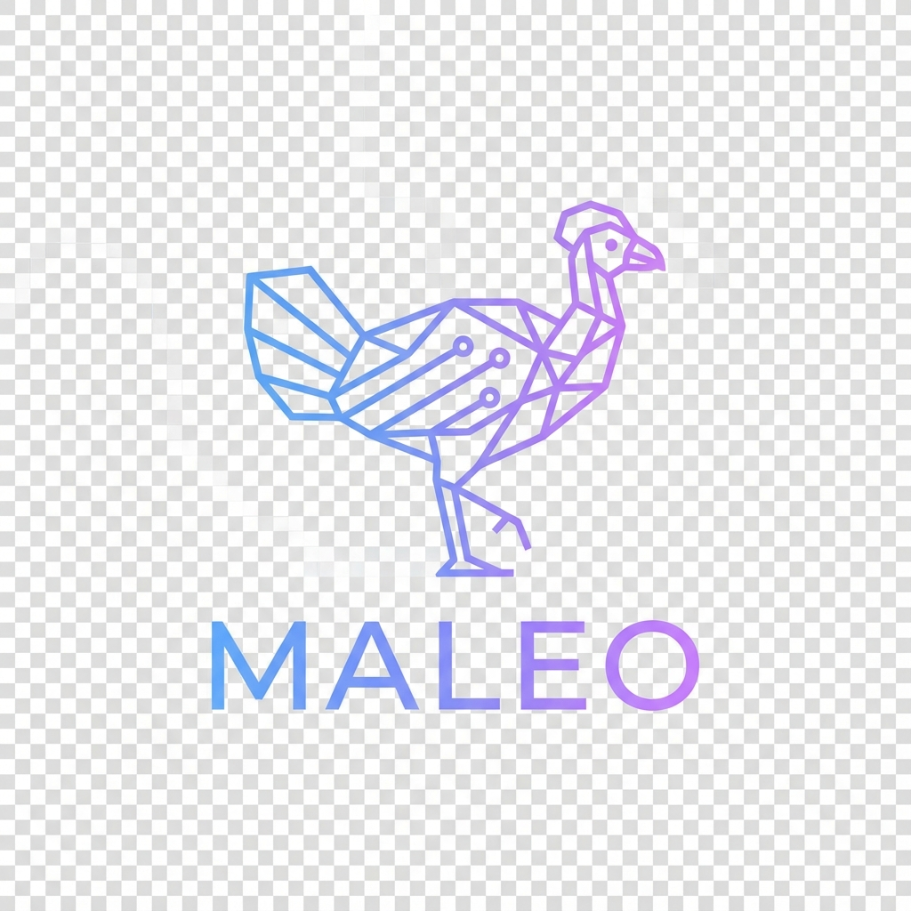

# MaleoOS



**MaleoOS** is a project by **IGOS Nusantara**. It is a Fedora Remix that combines the Omarchy desktop configuration (Hyprland-based) with the Nix package manager to provide a modern, beautiful, and flexible development experience.

## 🎯 Key Features

- **Hyprland Desktop Environment** - Modern tiling window manager based on Wayland
- **Omarchy-Inspired Configuration** - Beautiful and productive desktop configuration
- **Nix Package Manager** - Flexible package management with Nix
- **Multiple Themes** - Catppuccin, Nord, Gruvbox, Tokyo Night, and others
- **Developer-Focused** - Pre-configured tools for development

## 📦 What's Included?

### Desktop Environment
- Hyprland - Tiling window manager
- Waybar - Status bar
- Mako - Notification daemon
- SDDM - Display manager
- Rofi/Walker - Application launcher

### Development Tools
- Neovim - Text editor
- Git - Version control
- Docker/Podman - Containerization
- Mise - Runtime version manager
- Lazygit/Lazydocker - TUI tools

### Applications
- Chromium/Firefox - Web browser
- Alacritty/Kitty - Terminal emulator
- Nautilus - File manager
- LibreOffice - Office suite
- MPV - Media player

## 🚀 Installation

### Option 1: ISO Installation

1. Download ISO from [Releases](https://github.com/igos-nusantara/maleo-os/releases)
2. Burn to USB using Fedora Media Writer or `dd`
3. Boot from USB and follow the installer

### Option 2: Install on Existing Fedora

```bash
# Clone repository
git clone https://github.com/igos-nusantara/maleo-os.git
cd maleo-os

# Run installer
chmod +x install/install.sh
./install/install.sh
```

## 🎨 Themes

Maleo comes with several pre-installed themes:
- **Catppuccin** (default)
- Nord
- Gruvbox
- Tokyo Night
- Everforest
- Rose Pine

Change theme with:
```bash
maleo-theme set catppuccin
```

## 🔧 Configuration

Main configuration files are located at:
- `~/.config/hypr/` - Hyprland configuration
- `~/.config/waybar/` - Waybar configuration
- `~/.config/mako/` - Notification configuration
- `~/.local/share/maleo/` - Maleo defaults

## 📚 Documentation

- [Installation Guide](docs/installation.md)
- [Configuration Guide](docs/configuration.md)
- [Keybindings](docs/keybindings.md)
- [Troubleshooting](docs/troubleshooting.md)

## 🛠️ Building from Source

Requirements:
- Fedora 43 or newer
- `livecd-tools` package
- At least 20GB free disk space

### Option 1: Legacy Builder

```bash
# Install build dependencies
sudo dnf install livecd-tools

# Build ISO
cd build
sudo ./build-iso.sh
```

### Option 2: Docker Builder (Recommended)

Build without installing dependencies on your host. Requires Docker or Podman.

```bash
./build/build-docker.sh
```

## 🤝 Contributing

Contributions are welcome! Please read [CONTRIBUTING.md](CONTRIBUTING.md) for details.

## 📄 License

MaleoOS is released under the MIT License. See [LICENSE](LICENSE) for details.

## 🙏 Credits

- **IGOS Nusantara** - Project Maintainer
- **Omarchy** - Original configuration and inspiration by DHH
- **Fedora Project** - Base distribution
- **Hyprland** - Window manager
- **Nix** - Package manager

## ⚠️ Disclaimer

Maleo is a Fedora Remix and is not officially affiliated with or endorsed by the Fedora Project. Fedora and the Fedora logo are trademarks of Red Hat, Inc.
